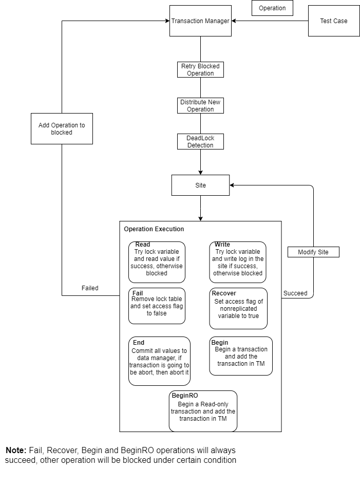

## RepCRec-NYU-ADB

###### A simple Replicated Concurrency Control and Recovery algorithm (RepCRec)

## How to run?
1. Make sure you have installed Python3.x  
2. Run `pip install -r requirements.txt` to install dependencies
3. Run `python main.py [f|d|i] -input {path/to/input} -output {path/to/output}`
> `f: The input source is a file contains single test case or multiple test cases which is separated by <END>, -input is the file path, -output is the path to save result`
>
> `d: The input source is a directory contains some test files, -input is the directory, -output is the directory to save the result`
>
> `i: Interactive mode, user can enter operation line by line`

## Test file
* Run `python main.py f -input {path/to/input_file} -output {path/to/result_file}`

## Test directory
* Run `python main.py d -input {path/to/input_directory} -output {path/to/result_directory}`

## Interactive Mode
* Run `python main.py i` in the folder of `./RepCRec-NYU-ADB`
* Interactive mode will initialize sites by default.
>`refresh` command will reinitialize site status 
>
>`<END>` command indicates the end of a test case.
>
>`quit` will exit program 

## Documentation
* We used Sphinx to generate documentation according to docstrings in each file.
* The detailed documentation is in *./docs/_build/html/index.html*
* This part discuss the simulation logic.

The core idea of our implementation is to abstract operations, all side effects are caused by the execution of the operation. So 
what we need to do is to embed the logic in each operation's execute function. 

#### Project Structure
```
.
|   .gitignore
|   configurations.py
|   main.py
|   README.md
|   requirments.txt
|
|---algorithms
|   |   DeadLockDetector.py
|   |   __init__.py
|
|---model
|   |   Operation.py
|   |   Site.py
|   |   Transaction.py
|   |   __init__.py
|   |
|   |---managers
|       |   DataManager.py
|       |   LockManager.py
|       |   TransactionManager.py
|       |   __init__.py
|
|---utils
|       driver.py
|       FileLoader.py
|       __init__.py
```

`Configuration.py`: global configuration variable, like the number of sites and unique variables in each site 

`main.py`: entry point of the program

`algorithms/DeadLockDetector.py`: contains the implementation of deadlock detection algorithm (Wait-For Graph)

`model/Operation.py`: the definition of different operation, including __Read__, __Write__, __Begin__, __BeginRO__,
__Dump__, __End__, __Fail__ and __Recover__.

`model/Site.py`: Site object, site will has a lock manager and a data manager

`model/Transaction.py`: Transaction object, holds the property of a transaction, for example, a flag to represent read-only transaction, also 
the operations it has

`model/managers/DataManager.py`: maintains the data store in the site, both log and committed values

`model/managers/LockMamager.py`: maintains the lock table in the site

`model/managers/TransactionManager.py`: holds all the information of the simulation, we attached all sites to it for convenience, but
do not store data in transaction manager. In this way, we simplify the communication between sites and transaction manager.

### WorkFlow
---

